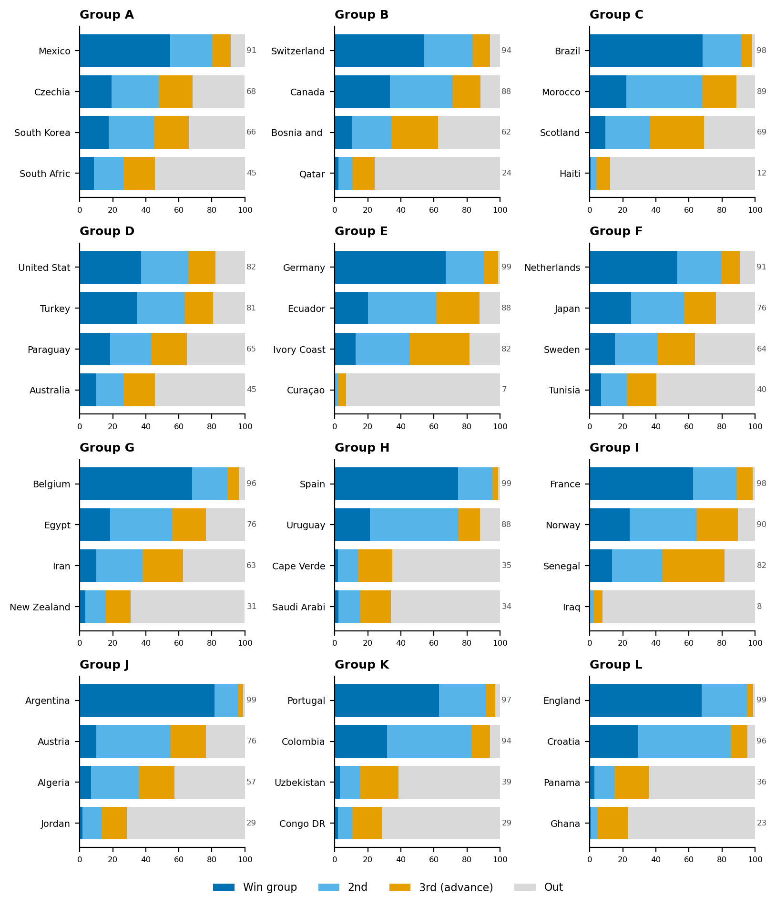

# AVRAA'S PREDICTION
## FIFA World Cup 2026 · June 11 – July 19

> **Champion: 🇪🇸 SPAIN** — beats Argentina 1-0 in the Final.  
> Podium: 🥈 Argentina · 🥉 France · 4th England

*Predictions locked before the June 11, 2026 kickoff (built June 7, Group K recalibrated to prediction-market prices, and a final pre-kickoff review of squad news that confirmed the entry). All kickoff times are Ulaanbaatar time (UTC+8). Write actual scores in the blank columns after each match.*

### How these picks were made (short version)

1. **Group matches** — live bookmaker odds (bet365, FanDuel, Betfair, collected June 5–7) converted to fair probabilities, then a Poisson goal model picks the *expected-value-optimal scoreline* under the pool's 3/2/1 rule (3 exact, 2 result+goal-difference, 1 result). That's why most picks are one-goal results like 1-0 — the goal-difference tier rewards getting the margin right — with a 1-1 draw on the most evenly-matched games.
2. **Knockout rounds** — World Football Elo ratings adjusted for confirmed injuries (Brazil without Rodrygo, Netherlands without Xavi Simons…) and host advantage (Mexico/USA at home).
3. **200,000 Monte Carlo simulations** of the whole tournament stress-tested every bracket call — four picks were changed because the simulations showed a likelier name in that bracket slot.

**Simulated champion odds:** Spain 27% · Argentina 19% · France 14% · England 7% · Colombia 4% · Portugal 4% · Brazil 4% · others <3%

*Reading the tables: **Exp.** is the model's expected points for that pick under the pool's 3/2/1 rule (3 exact, 2 result+goal-difference, 1 result) — higher means a more confident pick. Fill in **Actual** (the real 90-minute score) and **Pts** (what you scored) as the games are played.*

* * *
## Group Stage — Twelve Dashboards

Each team's qualification odds come from 100,000 simulations. The bars show the chance of winning the group (dark blue), finishing second (light blue), advancing as a best third-placed team (orange), or going out (grey).

### Group A — Host opener

*Mexico opens the whole tournament at the Azteca, 2,240m up.*

| Team | Win grp | 2nd | 3rd→adv | **Qualify** | Outlook |
|------|:------:|:---:|:------:|:-----------:|---------|
| 🥇 Mexico | 55% | 26% | 11% | **91%** | █████████░ |
| 🥈 Czechia | 19% | 29% | 20% | **68%** | ███████░░░ |
| 🥉 South Korea | 18% | 28% | 21% | **66%** | ███████░░░ |
| ▫️ South Africa | 8% | 18% | 19% | **45%** | █████░░░░░ |

🔮 **Pick:** Mexico is the clearest host-advantage story in the draw — opener at the Azteca (2,240 m altitude), ~68% market favorite, Jiménez in form. Second place is a genuine coin flip: South Korea over Czechia on Elo (1756 vs 1733) and tournament pedigree; their opener effectively decides it. Czechia still advances as a third-placer.

⭐ **Star:** Hirving Lozano (MEX)  
👀 **What to watch:** South Korea vs Czechia (MD1) decides 2nd  
⚡ **Biggest risk:** Czechia (68% qual) edges Korea for the runner-up spot

**Predicted scores:**

| # | Date (UB) | Match | Pick | Exp. | Actual | Pts |
|---|-----------|-------|:----:|:---:|:------:|:---:|
| 1 | Jun 12 03:00 | Mexico – South Africa | **1-0** | 1.08 | ____ | __ |
| 2 | Jun 12 10:00 | South Korea – Czechia | **1-1** | 0.74 | ____ | __ |
| 25 | Jun 19 00:00 | Czechia – South Africa | **1-0** | 0.84 | ____ | __ |
| 28 | Jun 19 09:00 | Mexico – South Korea | **1-0** | 0.95 | ____ | __ |
| 53 | Jun 25 09:00 | Czechia – Mexico | **0-1** | 0.90 | ____ | __ |
| 54 | Jun 25 09:00 | South Africa – South Korea | **0-1** | 0.79 | ____ | __ |

### Group B — Swiss lock

*Qatar (24% qual) is the field's weakest side — GD currency.*

| Team | Win grp | 2nd | 3rd→adv | **Qualify** | Outlook |
|------|:------:|:---:|:------:|:-----------:|---------|
| 🥇 Switzerland | 54% | 29% | 10% | **94%** | █████████░ |
| 🥈 Canada | 33% | 38% | 17% | **88%** | █████████░ |
| 🥉 Bosnia and Herzegovina | 10% | 24% | 28% | **62%** | ██████░░░░ |
| ▫️ Qatar | 2% | 8% | 13% | **24%** | ██░░░░░░░░ |

🔮 **Pick:** Switzerland is the quiet Elo monster (1894 — above Belgium). Canada gets host energy but the head-to-head tilts Swiss (50% vs 30%). Qatar is the weakest team in the field (Elo 1423) — everyone farms them for goal difference. Bosnia's win over Qatar books a third-place ticket.

⭐ **Star:** Granit Xhaka (SUI)  
👀 **What to watch:** Switzerland vs Canada (MD3) for top spot  
⚡ **Biggest risk:** Co-host Canada (88% qual) wins the group outright

**Predicted scores:**

| # | Date (UB) | Match | Pick | Exp. | Actual | Pts |
|---|-----------|-------|:----:|:---:|:------:|:---:|
| 3 | Jun 13 03:00 | Canada – Bosnia and Herzegovina | **1-0** | 0.90 | ____ | __ |
| 8 | Jun 14 03:00 | Qatar – Switzerland | **0-1** | 1.08 | ____ | __ |
| 26 | Jun 19 03:00 | Switzerland – Bosnia and Herzegovina | **1-0** | 1.03 | ____ | __ |
| 27 | Jun 19 06:00 | Canada – Qatar | **1-0** | 1.12 | ____ | __ |
| 51 | Jun 25 03:00 | Switzerland – Canada | **2-1** | 0.80 | ____ | __ |
| 52 | Jun 25 03:00 | Bosnia and Herzegovina – Qatar | **1-0** | 0.95 | ____ | __ |

### Group C — Selecao march

*Brazil at 98% qual even without Rodrygo and a doubtful Neymar.*

| Team | Win grp | 2nd | 3rd→adv | **Qualify** | Outlook |
|------|:------:|:---:|:------:|:-----------:|---------|
| 🥇 Brazil | 68% | 23% | 7% | **98%** | ██████████ |
| 🥈 Morocco | 22% | 46% | 20% | **89%** | █████████░ |
| 🥉 Scotland | 10% | 27% | 33% | **69%** | ███████░░░ |
| ▫️ Haiti | 0% | 4% | 8% | **12%** | █░░░░░░░░░ |

🔮 **Pick:** Brazil tops the group even without Rodrygo (ACL) and with Neymar's calf in doubt — Elo 1988 absorbs it. The pivotal game is Scotland–Morocco for second: the market is decisive (Morocco 50% vs 23%). Scotland's 3 points die on goal difference in the third-place table.

⭐ **Star:** Vinicius Jr (BRA)  
👀 **What to watch:** Scotland vs Morocco (MD2) for 2nd  
⚡ **Biggest risk:** Scotland (69% qual) upsets Morocco for second

**Predicted scores:**

| # | Date (UB) | Match | Pick | Exp. | Actual | Pts |
|---|-----------|-------|:----:|:---:|:------:|:---:|
| 5 | Jun 14 09:00 | Haiti – Scotland | **0-1** | 1.00 | ____ | __ |
| 7 | Jun 14 06:00 | Brazil – Morocco | **1-0** | 0.97 | ____ | __ |
| 29 | Jun 20 09:00 | Brazil – Haiti | **2-0** | 1.37 | ____ | __ |
| 30 | Jun 20 06:00 | Scotland – Morocco | **0-1** | 0.90 | ____ | __ |
| 49 | Jun 25 06:00 | Scotland – Brazil | **0-1** | 1.05 | ____ | __ |
| 50 | Jun 25 06:00 | Morocco – Haiti | **1-0** | 1.28 | ____ | __ |

### Group D — Coin-flip group

*Genuinely the hardest group to call: three teams within 17 pp.*

| Team | Win grp | 2nd | 3rd→adv | **Qualify** | Outlook |
|------|:------:|:---:|:------:|:-----------:|---------|
| 🥇 United States | 37% | 29% | 16% | **82%** | ████████░░ |
| 🥈 Turkey | 35% | 29% | 17% | **81%** | ████████░░ |
| 🥉 Paraguay | 18% | 25% | 22% | **65%** | ██████░░░░ |
| ▫️ Australia | 10% | 17% | 18% | **45%** | █████░░░░░ |

🔮 **Pick:** The tightest group in the tournament. Turkey has the higher Elo (1906), but the USA has host advantage and the market's blessing (group-winner: USA 40%, Turkey 35%); their head-to-head priced at a literal 36.3/36.3 tie, broken toward the USA because simulations show it routes both teams into safer bracket slots. Paraguay (Elo 1833, underrated) advances third.

⭐ **Star:** Arda Guler (TUR)  
👀 **What to watch:** Turkey vs USA (MD3) — 82% vs 81%, the tightest in the draw  
⚡ **Biggest risk:** Turkey tops it and reroutes the whole bracket

**Predicted scores:**

| # | Date (UB) | Match | Pick | Exp. | Actual | Pts |
|---|-----------|-------|:----:|:---:|:------:|:---:|
| 4 | Jun 13 09:00 | United States – Paraguay | **1-0** | 0.86 | ____ | __ |
| 6 | Jun 14 12:00 | Australia – Turkey | **0-1** | 0.94 | ____ | __ |
| 31 | Jun 20 12:00 | Turkey – Paraguay | **1-0** | 0.82 | ____ | __ |
| 32 | Jun 20 03:00 | United States – Australia | **1-0** | 0.95 | ____ | __ |
| 59 | Jun 26 10:00 | Turkey – United States | **1-1** | 0.68 | ____ | __ |
| 60 | Jun 26 10:00 | Paraguay – Australia | **1-0** | 0.85 | ____ | __ |

### Group E — German efficiency

*Germany vs Curacao is the tournament's biggest mismatch (92%).*

| Team | Win grp | 2nd | 3rd→adv | **Qualify** | Outlook |
|------|:------:|:---:|:------:|:-----------:|---------|
| 🥇 Germany | 67% | 24% | 8% | **99%** | ██████████ |
| 🥈 Ecuador | 20% | 42% | 26% | **88%** | █████████░ |
| 🥉 Ivory Coast | 13% | 33% | 36% | **82%** | ████████░░ |
| ▫️ Curaçao | 0% | 2% | 5% | **7%** | █░░░░░░░░░ |

🔮 **Pick:** Germany–Curaçao is the heaviest mismatch of the tournament (92% — hence the 3-0). Ecuador's Elo (1935) is higher than Uruguay's or Croatia's — an elite team hiding behind low name recognition; they beat Ivory Coast in the decider (42% vs 28%). Ivory Coast still advances as one of the two best third-placers.

⭐ **Star:** Florian Wirtz (GER)  
👀 **What to watch:** Ecuador vs Germany (MD3) for the group  
⚡ **Biggest risk:** Ecuador (88% qual, Elo 1935) wins the group, not just 2nd

**Predicted scores:**

| # | Date (UB) | Match | Pick | Exp. | Actual | Pts |
|---|-----------|-------|:----:|:---:|:------:|:---:|
| 9 | Jun 15 07:00 | Ivory Coast – Ecuador | **0-1** | 0.83 | ____ | __ |
| 10 | Jun 15 01:00 | Germany – Curaçao | **3-0** | 1.32 | ____ | __ |
| 33 | Jun 21 04:00 | Germany – Ivory Coast | **1-0** | 1.04 | ____ | __ |
| 34 | Jun 21 08:00 | Ecuador – Curaçao | **2-0** | 1.15 | ____ | __ |
| 55 | Jun 26 04:00 | Curaçao – Ivory Coast | **0-2** | 1.15 | ____ | __ |
| 56 | Jun 26 04:00 | Ecuador – Germany | **0-1** | 0.95 | ____ | __ |

### Group F — Oranje cruise

*Both NED and JPN carry ACL/hamstring losses — depth decides.*

| Team | Win grp | 2nd | 3rd→adv | **Qualify** | Outlook |
|------|:------:|:---:|:------:|:-----------:|---------|
| 🥇 Netherlands | 53% | 26% | 12% | **91%** | █████████░ |
| 🥈 Japan | 25% | 32% | 19% | **76%** | ████████░░ |
| 🥉 Sweden | 15% | 26% | 22% | **64%** | ██████░░░░ |
| ▫️ Tunisia | 7% | 16% | 18% | **40%** | ████░░░░░░ |

🔮 **Pick:** Decided on day one — Netherlands–Japan is the marquee group game (46% vs 28%). The Dutch absorb the Xavi Simons ACL loss; Japan miss Mitoma's wing threat but still take second comfortably. Sweden's win over Tunisia is worth a third-place ticket.

⭐ **Star:** Cody Gakpo (NED)  
👀 **What to watch:** Netherlands vs Japan (MD1) sets the tone  
⚡ **Biggest risk:** Japan (76% qual) beats the Dutch and tops the group

**Predicted scores:**

| # | Date (UB) | Match | Pick | Exp. | Actual | Pts |
|---|-----------|-------|:----:|:---:|:------:|:---:|
| 11 | Jun 15 04:00 | Netherlands – Japan | **1-0** | 0.81 | ____ | __ |
| 12 | Jun 15 10:00 | Sweden – Tunisia | **1-0** | 0.89 | ____ | __ |
| 35 | Jun 21 01:00 | Netherlands – Sweden | **1-0** | 0.99 | ____ | __ |
| 36 | Jun 21 12:00 | Tunisia – Japan | **0-1** | 0.94 | ____ | __ |
| 57 | Jun 26 07:00 | Japan – Sweden | **1-0** | 0.77 | ____ | __ |
| 58 | Jun 26 07:00 | Tunisia – Netherlands | **0-1** | 1.04 | ____ | __ |

### Group G — Soft draw

*Weakest group by rating — Belgium's easy path matters later.*

| Team | Win grp | 2nd | 3rd→adv | **Qualify** | Outlook |
|------|:------:|:---:|:------:|:-----------:|---------|
| 🥇 Belgium | 68% | 21% | 7% | **96%** | ██████████ |
| 🥈 Egypt | 18% | 38% | 20% | **76%** | ████████░░ |
| 🥉 Iran | 10% | 28% | 24% | **63%** | ██████░░░░ |
| ▫️ New Zealand | 3% | 12% | 15% | **31%** | ███░░░░░░░ |

🔮 **Pick:** The weakest group on paper. Belgium (1866) wins it without being impressive — which is exactly why the simulations love their bracket path. Egypt–Iran decides second (42% vs 27%, Salah's last World Cup vs Iran's organized block). Iran advances third.

⭐ **Star:** Kevin De Bruyne (BEL)  
👀 **What to watch:** Egypt vs Iran (MD3) for 2nd  
⚡ **Biggest risk:** Iran (63% qual) edges Egypt behind Belgium

**Predicted scores:**

| # | Date (UB) | Match | Pick | Exp. | Actual | Pts |
|---|-----------|-------|:----:|:---:|:------:|:---:|
| 15 | Jun 16 09:00 | Iran – New Zealand | **1-0** | 0.91 | ____ | __ |
| 16 | Jun 16 03:00 | Belgium – Egypt | **1-0** | 0.96 | ____ | __ |
| 39 | Jun 22 03:00 | Belgium – Iran | **1-0** | 1.06 | ____ | __ |
| 40 | Jun 22 09:00 | New Zealand – Egypt | **0-1** | 1.00 | ____ | __ |
| 63 | Jun 27 11:00 | Egypt – Iran | **1-0** | 0.83 | ____ | __ |
| 64 | Jun 27 11:00 | New Zealand – Belgium | **0-2** | 1.12 | ____ | __ |

### Group H — Champion runway

*Spain at 99% qual; the only drama is the 3rd-place scrap.*

| Team | Win grp | 2nd | 3rd→adv | **Qualify** | Outlook |
|------|:------:|:---:|:------:|:-----------:|---------|
| 🥇 Spain | 75% | 21% | 3% | **99%** | ██████████ |
| 🥈 Uruguay | 21% | 54% | 13% | **88%** | █████████░ |
| 🥉 Cape Verde | 2% | 12% | 20% | **35%** | ███░░░░░░░ |
| ▫️ Saudi Arabia | 2% | 13% | 19% | **34%** | ███░░░░░░░ |

🔮 **Pick:** The champion's runway. Spain is the highest-rated team in the field (Elo 2165), Yamal's fitness trending right, 85%+ market favorite in two of three games. Bielsa's healthy Uruguay is a rock-solid second. Cape Verde's fairytale ends at 3 points, GD −2.

⭐ **Star:** Lamine Yamal (ESP)  
👀 **What to watch:** Cape Verde vs Saudi Arabia — 35% vs 34% for the 3rd ticket  
⚡ **Biggest risk:** Neither 3rd-placer qualifies; Uruguay slips to 2nd

**Predicted scores:**

| # | Date (UB) | Match | Pick | Exp. | Actual | Pts |
|---|-----------|-------|:----:|:---:|:------:|:---:|
| 13 | Jun 16 06:00 | Saudi Arabia – Uruguay | **0-1** | 1.02 | ____ | __ |
| 14 | Jun 16 00:00 | Spain – Cape Verde | **2-0** | 1.22 | ____ | __ |
| 37 | Jun 22 06:00 | Uruguay – Cape Verde | **1-0** | 1.08 | ____ | __ |
| 38 | Jun 22 00:00 | Spain – Saudi Arabia | **2-0** | 1.18 | ____ | __ |
| 65 | Jun 27 08:00 | Cape Verde – Saudi Arabia | **1-0** | 0.75 | ____ | __ |
| 66 | Jun 27 08:00 | Uruguay – Spain | **0-1** | 0.98 | ____ | __ |

### Group I — Haaland arrives

*Norway's first World Cup since 1998, and Senegal is the field's best 3rd.*

| Team | Win grp | 2nd | 3rd→adv | **Qualify** | Outlook |
|------|:------:|:---:|:------:|:-----------:|---------|
| 🥇 France | 62% | 26% | 10% | **98%** | ██████████ |
| 🥈 Norway | 24% | 41% | 25% | **90%** | █████████░ |
| 🥉 Senegal | 13% | 31% | 38% | **82%** | ████████░░ |
| ▫️ Iraq | 0% | 2% | 5% | **8%** | █░░░░░░░░░ |

🔮 **Pick:** France tops it (66% market) despite the odd friendly loss — depth absorbs anything. The story is Norway: first World Cup since 1998, Haaland fit, clear seconds (24% group-winner vs Senegal's 10%); Norway–Senegal on matchday 2 is the real final. Senegal advances as the strongest third-placer in the tournament — which is why Portugal drawing them in the R32 matters.

⭐ **Star:** Erling Haaland (NOR)  
👀 **What to watch:** Norway vs Senegal (MD2) — the group's real final  
⚡ **Biggest risk:** Senegal (82% qual) beats Norway and takes 2nd

**Predicted scores:**

| # | Date (UB) | Match | Pick | Exp. | Actual | Pts |
|---|-----------|-------|:----:|:---:|:------:|:---:|
| 17 | Jun 17 03:00 | France – Senegal | **1-0** | 1.02 | ____ | __ |
| 18 | Jun 17 06:00 | Iraq – Norway | **0-2** | 1.12 | ____ | __ |
| 41 | Jun 23 08:00 | Norway – Senegal | **1-0** | 0.88 | ____ | __ |
| 42 | Jun 23 05:00 | France – Iraq | **2-0** | 1.35 | ____ | __ |
| 61 | Jun 27 03:00 | Norway – France | **0-1** | 0.94 | ____ | __ |
| 62 | Jun 27 03:00 | Senegal – Iraq | **2-0** | 1.11 | ____ | __ |

### Group J — Albiceleste glide

*Argentina's lowest-variance group; Messi's last World Cup.*

| Team | Win grp | 2nd | 3rd→adv | **Qualify** | Outlook |
|------|:------:|:---:|:------:|:-----------:|---------|
| 🥇 Argentina | 82% | 14% | 3% | **99%** | ██████████ |
| 🥈 Austria | 10% | 45% | 21% | **76%** | ████████░░ |
| 🥉 Algeria | 7% | 29% | 22% | **57%** | ██████░░░░ |
| ▫️ Jordan | 2% | 12% | 15% | **29%** | ███░░░░░░░ |

🔮 **Pick:** The defending champions stroll — Argentina's Elo (2113) towers here, Messi's hamstring managed. Austria is Europe's stealth team (Rangnick-built pressing) and beats Algeria in the decider (43% vs 28%). Algeria's win over Jordan secures third place.

⭐ **Star:** Lionel Messi (ARG)  
👀 **What to watch:** Algeria vs Austria (MD3) for 2nd  
⚡ **Biggest risk:** Algeria (57% qual) overtakes Austria for the runner-up spot

**Predicted scores:**

| # | Date (UB) | Match | Pick | Exp. | Actual | Pts |
|---|-----------|-------|:----:|:---:|:------:|:---:|
| 19 | Jun 17 09:00 | Argentina – Algeria | **1-0** | 1.08 | ____ | __ |
| 20 | Jun 17 12:00 | Austria – Jordan | **1-0** | 1.07 | ____ | __ |
| 43 | Jun 23 01:00 | Argentina – Austria | **2-0** | 1.15 | ____ | __ |
| 44 | Jun 23 11:00 | Jordan – Algeria | **0-1** | 0.75 | ____ | __ |
| 69 | Jun 28 10:00 | Algeria – Austria | **0-1** | 0.80 | ____ | __ |
| 70 | Jun 28 10:00 | Jordan – Argentina | **0-2** | 1.22 | ____ | __ |

### Group K — Market rewrite

*Portugal & Colombia both above 94% qual — a two-horse group.*

| Team | Win grp | 2nd | 3rd→adv | **Qualify** | Outlook |
|------|:------:|:---:|:------:|:-----------:|---------|
| 🥇 Portugal | 63% | 28% | 6% | **97%** | ██████████ |
| 🥈 Colombia | 32% | 51% | 11% | **94%** | █████████░ |
| 🥉 Uzbekistan | 3% | 12% | 23% | **39%** | ████░░░░░░ |
| ▫️ Congo DR | 2% | 8% | 18% | **29%** | ███░░░░░░░ |

🔮 **Pick:** The group rewritten on deadline day. Raw Elo called Portugal–Colombia a dead tie; the prediction markets said Portugal 63% / Colombia 32% to win the group — so the model was recalibrated (140 Elo-equivalent points) and Portugal now tops it via a 1-0 in the head-to-head. This single call transforms Portugal's tournament from R32 exit to QF run. The biggest known sensitivity in the bracket.

⭐ **Star:** Cristiano Ronaldo (POR)  
👀 **What to watch:** Colombia vs Portugal (MD3) — the call that flipped on market data  
⚡ **Biggest risk:** The Elo tie was right and Colombia (94% qual) tops the group

**Predicted scores:**

| # | Date (UB) | Match | Pick | Exp. | Actual | Pts |
|---|-----------|-------|:----:|:---:|:------:|:---:|
| 23 | Jun 18 01:00 | Portugal – Congo DR | **1-0** | 1.08 | ____ | __ |
| 24 | Jun 18 10:00 | Uzbekistan – Colombia | **0-1** | 1.06 | ____ | __ |
| 47 | Jun 24 01:00 | Portugal – Uzbekistan | **2-0** | 1.12 | ____ | __ |
| 48 | Jun 24 10:00 | Colombia – Congo DR | **2-0** | 1.18 | ____ | __ |
| 71 | Jun 28 07:30 | Colombia – Portugal | **0-1** | 0.95 | ____ | __ |
| 72 | Jun 28 07:30 | Congo DR – Uzbekistan | **0-1** | 0.75 | ____ | __ |

### Group L — Three Lions engine

*England's reliability is what parks Croatia in its R32 slot.*

| Team | Win grp | 2nd | 3rd→adv | **Qualify** | Outlook |
|------|:------:|:---:|:------:|:-----------:|---------|
| 🥇 England | 68% | 27% | 4% | **99%** | ██████████ |
| 🥈 Croatia | 29% | 56% | 10% | **96%** | ██████████ |
| 🥉 Panama | 3% | 12% | 21% | **36%** | ████░░░░░░ |
| ▫️ Ghana | 0% | 4% | 18% | **23%** | ██░░░░░░░░ |

🔮 **Pick:** England dominates (68% market, no injuries) — and that reliability quietly powers the bracket: because England nearly always wins Group L, Croatia nearly always lands second, which is why Croatia owns its R32 slot. Modrić's farewell squad is in poor warm-up form (−10 rating) but still outclasses Ghana and Panama.

⭐ **Star:** Jude Bellingham (ENG)  
👀 **What to watch:** England vs Croatia (MD1), a knockout-quality opener  
⚡ **Biggest risk:** Croatia (96% qual) wins the group instead of England

**Predicted scores:**

| # | Date (UB) | Match | Pick | Exp. | Actual | Pts |
|---|-----------|-------|:----:|:---:|:------:|:---:|
| 21 | Jun 18 07:00 | Ghana – Panama | **1-0** | 0.84 | ____ | __ |
| 22 | Jun 18 04:00 | England – Croatia | **1-0** | 0.94 | ____ | __ |
| 45 | Jun 24 04:00 | England – Ghana | **2-0** | 1.37 | ____ | __ |
| 46 | Jun 24 07:00 | Panama – Croatia | **0-1** | 0.99 | ____ | __ |
| 67 | Jun 28 05:00 | Panama – England | **0-2** | 1.06 | ____ | __ |
| 68 | Jun 28 05:00 | Croatia – Ghana | **2-0** | 1.29 | ____ | __ |

* * *
## Knockout Bracket

### Round of 32 — June 28 to July 3

| M# | Date (UB) | Match | Prediction | Advances | Exp. | Actual | Pts |
|----|-----------|-------|:---------:|----------|:---:|:------:|:---:|
| 73 | Jun 29 03:00 | South Korea – Canada | **0-1** | Canada | 0.85 | ____ | __ |
| 74 | Jun 30 04:30 | Germany – Paraguay | **1-0** | Germany | 0.88 | ____ | __ |
| 75 | Jun 30 09:00 | Netherlands – Morocco | **1-0** | Netherlands | 0.92 | ____ | __ |
| 76 | Jun 30 01:00 | Brazil – Japan | **1-0** | Brazil | 0.83 | ____ | __ |
| 77 | Jul 01 05:00 | France – Sweden | **1-0** | France | 1.37 | ____ | __ |
| 78 | Jul 01 01:00 | Ecuador – Norway | **0-1** | Norway | 0.65 | ____ | __ |
| 79 | Jul 01 09:00 | Mexico – Ivory Coast | **1-0** | Mexico | 1.14 | ____ | __ |
| 80 | Jul 02 00:00 | England – Algeria | **1-0** | England | 1.23 | ____ | __ |
| 81 | Jul 02 08:00 | United States – Bosnia and Herzegovina | **1-0** | United States | 1.04 | ____ | __ |
| 82 | Jul 02 04:00 | Belgium – Czechia | **1-0** | Belgium | 0.95 | ____ | __ |
| 83 | Jul 03 07:00 | Colombia – Croatia | **0-1** | Croatia | 0.71 | ____ | __ |
| 84 | Jul 03 03:00 | Spain – Austria | **1-0** | Spain | 1.31 | ____ | __ |
| 85 | Jul 03 11:00 | Switzerland – Iran | **1-0** | Switzerland | 0.94 | ____ | __ |
| 86 | Jul 04 06:00 | Argentina – Uruguay | **1-0** | Argentina | 1.12 | ____ | __ |
| 87 | Jul 04 09:30 | Portugal – Senegal | **1-0** | Portugal | 1.04 | ____ | __ |
| 88 | Jul 04 02:00 | Turkey – Egypt | **1-0** | Turkey | 1.09 | ____ | __ |

**Logic of this round:** every pick maximizes *slot emergence* — the probability the named team actually occupies and wins that bracket slot across 200,000 simulations — not just head-to-head strength. Three picks deliberately go against the head-to-head favorite: **Norway over Ecuador** (Norway's path to the slot is far more reliable, +4pp), **Croatia over Colombia** (England's dominance parks Croatia in this slot with high certainty), and the structural calls around Group D. Portugal's M87 emergence (50.7%) is the strongest slot claim in the entire bracket. Mexico at the Azteca and the USA in Arlington carry host bonuses.

### Round of 16 — July 4 to 7

| M# | Date (UB) | Match | Prediction | Advances | Exp. | Actual | Pts |
|----|-----------|-------|:---------:|----------|:---:|:------:|:---:|
| 89 | Jul 05 05:00 | Germany – France | **0-1** | France | 1.00 | ____ | __ |
| 90 | Jul 05 01:00 | Canada – Netherlands | **0-1** | Netherlands | 0.90 | ____ | __ |
| 91 | Jul 06 04:00 | Brazil – Norway | **1-0** | Brazil | 0.80 | ____ | __ |
| 92 | Jul 06 08:00 | Mexico – England | **0-1** | England | 0.91 | ____ | __ |
| 93 | Jul 07 03:00 | Croatia – Spain | **0-1** | Spain | 1.15 | ____ | __ |
| 94 | Jul 07 08:00 | United States – Belgium | **0-1** | Belgium | 0.88 | ____ | __ |
| 95 | Jul 08 00:00 | Argentina – Turkey | **1-0** | Argentina | 1.09 | ____ | __ |
| 96 | Jul 08 04:00 | Switzerland – Portugal | **0-1** | Portugal | 1.00 | ____ | __ |

**Key calls:** France ends Germany (Elo 2081 vs 1925 — a quarter-final-quality tie too early). **Belgium over the USA** was the simulations' biggest correction (+9.6pp): Belgium's soft path through Group G makes them far likelier to even be here than any Group D survivor. England eliminates host Mexico at the Azteca — atmosphere loses to Elo gap (2020 vs 1908). Brazil handles Haaland's Norway; Spain ends Croatia; Portugal beats Switzerland in the slot the market opened for him.

### Quarter-finals — July 9 to 11

| M# | Date (UB) | Match | Prediction | Advances | Exp. | Actual | Pts |
|----|-----------|-------|:---------:|----------|:---:|:------:|:---:|
| 97 | Jul 10 04:00 | France – Netherlands | **1-0** | France | 0.98 | ____ | __ |
| 98 | Jul 11 03:00 | Spain – Belgium | **1-0** | Spain | 1.25 | ____ | __ |
| 99 | Jul 12 05:00 | Brazil – England | **0-1** | England | 0.80 | ____ | __ |
| 100 | Jul 12 09:00 | Argentina – Portugal | **1-0** | Argentina | 0.81 | ____ | __ |

**Key calls:** France–Netherlands is the closest QF (56/19/25) — French depth decides it. Spain dispatches Belgium (71%). **England over Brazil** is the boldest call of the bracket: a 44/28 market edge for England plus Brazil's Rodrygo/Neymar injuries; this is where the sheet wins or loses its swagger. Argentina ends Portugal's run (38% vs 21% slot emergence) — Messi vs Ronaldo's heirs, one last time.

### Semi-finals — July 14 & 15

| M# | Date (UB) | Match | Prediction | Advances | Exp. | Actual | Pts |
|----|-----------|-------|:---------:|----------|:---:|:------:|:---:|
| 101 | Jul 15 03:00 | France – Spain | **0-1** | Spain | 0.85 | ____ | __ |
| 102 | Jul 16 03:00 | England – Argentina | **0-1** | Argentina | 0.88 | ____ | __ |

**Key calls:** Spain over France (48% vs 25% in the matchup) — the two best teams meet one round early; Spain's midfield control beats French transition. Argentina over England (50% vs 24%): tournament know-how against a team that historically blinks in semis.

### Third place — July 18

| M# | Date (UB) | Match | Prediction | Advances | Exp. | Actual | Pts |
|----|-----------|-------|:---------:|----------|:---:|:------:|:---:|
| 103 | Jul 19 05:00 | France – England | **1-0** | France | 0.81 | ____ | __ |

**Why France:** the third-place game rewards squad depth and motivation management — France has more of both than England (45/27/28).

### FINAL — July 19, MetLife Stadium

| M# | Date (UB) | Match | Prediction | Advances | Exp. | Actual | Pts |
|----|-----------|-------|:---------:|----------|:---:|:------:|:---:|
| 104 | Jul 20 03:00 | Spain – Argentina | **1-0** | SPAIN 🏆 | 0.78 | ____ | __ |

**Why Spain:** the most likely final (10.8% of all simulations — no other pairing scores higher) and the most likely champion (27.4%). Spain beats Argentina in 59% of simulated finals: the Elo gap (2160 vs 2113 adjusted), a younger core, and the deepest midfield in the tournament. Predicted score 1-0 — the modal scoreline at 13.2%. Honesty box: Spain still fails to win 72.6% of simulated tournaments; this is the best single bet, not a promise.

* * *
## Tournament Diary — What Went Wrong & What We Learned

*Predictions above are locked (before the June 11 kickoff). This diary tracks reality against the model after each matchday: points earned, calls that broke, and the updated outlook. The picks never change — the understanding does.*

| Date | Matches | Pts won / possible | What went wrong (or right) | Bracket implications |
|------|---------|-------------------|---------------------------|---------------------|
| Jun 11 |  |  |  |  |
| Jun 12 |  |  |  |  |
| Jun 13 |  |  |  |  |
| Jun 14 |  |  |  |  |
| Jun 15 |  |  |  |  |
| Jun 16 |  |  |  |  |
| Jun 17 |  |  |  |  |
| Jun 18 |  |  |  |  |
| Jun 19 |  |  |  |  |
| Jun 20 |  |  |  |  |
| Jun 21 |  |  |  |  |
| Jun 22 |  |  |  |  |
| Jun 23 |  |  |  |  |
| Jun 24 |  |  |  |  |
| Jun 25 |  |  |  |  |
| Jun 26 |  |  |  |  |
| Jun 27 |  |  |  |  |
| — R32 Jun 28–Jul 3 |  |  |  |  |
| — R16 Jul 4–7 |  |  |  |  |
| — QF Jul 9–11 |  |  |  |  |
| — SF Jul 14–15 |  |  |  |  |
| — Final Jul 18–19 |  |  |  |  |

* * *
### Methodology (for the curious)

- **Odds → probabilities**: bookmaker margins stripped by normalising implied probabilities. Matchday-3 fixtures without published odds use Elo-based estimates.
- **Poisson scorelines**: for each match, goal rates (λ-home, λ-away) are fitted to reproduce the market's win/draw/loss probabilities; the predicted score maximises expected points under the pool's 3/2/1 rule, P(exact) + P(result and goal difference) + P(result).
- **Knockout model**: Elo win expectancy 1/(1+10^(−ΔElo/400)); injury adjustments Brazil −20, Netherlands −15, Japan −10, Croatia −10, Spain −5; hosts +40 (fading to +20 late).
- **Slot-emergence optimisation**: knockout picks maximise P(team actually occupies and wins that bracket slot) across 200,000 simulated tournaments — not just head-to-head strength. This is why Croatia (27.5%) is picked over Portugal (25.1%) in M83: Portugal too often wins his group and never plays that match at all.
- **Machine-learning risk check**: a Random Forest *and* XGBoost (gradient boosting) trained on 40,000 simulated tournaments agree (rank correlation 0.83) that getting **Group H right (Spain) is the single highest-leverage call** — SHAP says naming Spain as Group H winner is worth **+0.79 knockout points**, ~3× the weakest group call — because Spain's path runs 6 matches deep. Both models also agree that group results explain only **~50% of the bracket score**; the rest is knockout luck. The call to protect above all: Spain topping Group H.
- Model: odds research + Poisson fitting + Elo Monte Carlo, built June 7 and locked at the June 11 kickoff. Good luck to everyone — Авраа.
